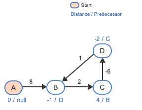
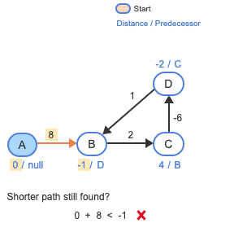
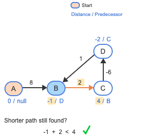
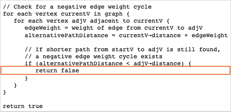
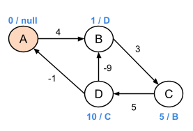
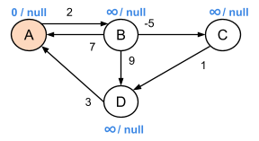
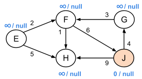

# Week 11: GraphPath

## Overview

This document provides a comprehensive guide to two fundamental shortest path algorithms: Dijkstra's Algorithm and Bellman-Ford's Algorithm. These algorithms are crucial in solving graph-related problems and finding the most efficient routes in various applications.

## Table of Contents
- [Dijkstra's Algorithm](#dijkstras-algorithm)
  - [Characteristics](#characteristics)
  - [Example Procedure](#example-procedure)
  - [Pseudocode](#pseudocode)
  - [Time Complexity](#time-complexity)
- [Bellman-Ford's Algorithm](#bellman-fords-algorithm)
  - [Characteristics](#characteristics-1)
  - [Initialization](#initialization)
  - [Relaxation](#relaxation)
  - [Negative Weight Cycle Check](#negative-weight-cycle-check)
  - [Example Procedure](#example-procedure-1)
  - [Pseudocode](#pseudocode-1)
  - [Time Complexity](#time-complexity-1)
- [Comparative Analysis](#comparative-analysis)

## Dijkstra's Algorithm

### Characteristics
- Used to find the shortest path from a starting node to all other nodes in a graph
- Works on both directed and undirected graphs
- Requires **positive weights only**
- Efficient for graphs without negative edge weights

### Example, whats the shortest path here? between 1 and 2:
 

### Example Procedure

Consider a graph with the following edges:
- 0 --1--> 1 
- 0 --4--> 2 
- 1 --2--> 2 
- 1 --6--> 3 
- 2 --3--> 3

**Step-by-Step Process:**
1. **Initialization**: 
   - Start at node 0 with distance 0
   - Set all other nodes' distances to infinity

2. **Node Visitation**:
   - Visit Node 0: Update neighbors
     * Distance to 1: 1
     * Distance to 2: 4
   - Visit Node 1: Update neighbors
     * Distance to 2: min(4, 1+2) = 3
     * Distance to 3: 1+6 = 7
   - Visit Node 2: Update neighbor
     * Distance to 3: min(7, 3+3) = 6
   - Visit Node 3: Completed

### Pseudocode
```python
Algorithm Dijkstra(Graph, source):
    // Initialization
    Create vertex set Q
    For each vertex v in Graph:
        distance[v] ← INFINITY
        previous[v] ← UNDEFINED
        Add v to Q
    
    // Distance to source is zero
    distance[source] ← 0
    
    // Main algorithm
    While Q is not empty:
        // Select vertex u in Q with smallest distance
        u ← vertex in Q with minimum distance[u]
        Remove u from Q
        
        // For each neighbor v of u still in Q
        For each neighbor v of u:
            // Calculate alternative path length
            alt ← distance[u] + length(u, v)
            
            // If alternative path is shorter, update distance
            If alt < distance[v]:
                distance[v] ← alt
                previous[v] ← u
    
    // Return both distances and previous vertices for path reconstruction
    Return distance[], previous[]


def dijkstra(graph, start):
    distances = {vertex: float('infinity') for vertex in graph}
    distances[start] = 0
    pq = [(0, start)]
    
    while pq:
        current_distance, current_vertex = heapq.heappop(pq)
        
        if current_distance > distances[current_vertex]:
            continue
        
        for neighbor, weight in graph[current_vertex].items():
            distance = current_distance + weight
            
            if distance < distances[neighbor]:
                distances[neighbor] = distance
                heapq.heappush(pq, (distance, neighbor))
    
    return distances
```

### Time Complexity
- Using a list: O(V²)
- Using a binary heap: O((E + V) log V)
- Using a Fibonacci heap: O(E + V log V)

## Bellman-Ford's Algorithm

### Characteristics
- Can handle graphs with **negative edge weights**
- Detects negative weight cycles
- More versatile but slower compared to Dijkstra's algorithm

### Initialization
- Set all node distances to infinity
- Set the starting node's distance to 0
- Initialize predecessors as null

### Relaxation
For each edge (u, v) with weight w:
- Check if `distance[v] > distance[u] + w`
- If true, update `distance[v]` and set predecessor of v to u

### Negative Weight Cycle Check
- Perform an additional iteration after V-1 main iterations
- If a shorter path is found, a negative weight cycle exists

#### Walk Through



- After visiting all vertices V-1 times, the Bellman-Ford algorithm checks for negative edge weight cycles.
- We have to do check the following edges: A->B, B->C, C->D, D->B
- Let's go through one by one. Let's start off with edge **A->B**   

- We can see that there is no shorter path. Let's check for edge B->C!

- Here, we can see that there is a shorter path is found through B to C, so a negative edge weight cycle exists. 
- So the algorithm returns false, indicating a shortest path does not exist!
(./images/image7.png)

### Quick Check

Let's do a small example:



**Question 1:**: Given the following result from the Bellman-Ford algorithm for a start vertex of A, a negative edge weight cycle is found when checking adjacent vertices of vertex _____.
    - B
    - C
    - D

**Answer:**: The path through **B to C** has distance 1 + 3 = 4, which is less than than C's distance of 5. Because a shorter path is still found after the V-1 iterations, a **negative edge weight exists**.


### Example Procedure

Consider a graph with these edges:
- 0 --1--> 1
- 0 --4--> 2
- 1 ---3--> 2
- 1 --6--> 3
- 2 --3--> 3

**Step-by-Step Process:**
1. **Initialization**: 
   - Start at node 0 with distance 0
   - Set all other nodes' distances to infinity

2. **Iterations**:
   - First Iteration:
     * Relax 0→1: distance to 1 = 1
     * Relax 0→2: distance to 2 = 4
     * Relax 1→2: distance to 2 = -2
     * Relax 1→3: distance to 3 = 7
     * Relax 2→3: distance to 3 = 1

3. **Cycle Check**:
   - No further updates
   - No negative weight cycle detected

### 2nd Example

The start vertex is A. In each main iteration, vertices in the graph are visited in the following order: A, B, C, D.



**Question 1**: What are B's values after the first iteration?
    - 2/A
    - ∞/NULL

**Answer:**: Per the instructions, A is visited first. B is adjacent, and the path from A to B has distance 0 + 2, which is less than B's current distance of ∞. So B is updated to **2 / A**.

**Question 2**: What are C's values after the first iteration?
    - -5/B
    - -3/B
    - ∞/NULL

**Answer:**: When A was visited, B is adjacent with distance from A to B of 0 + 2 = 2, so was updated to 2 / A. Next, when B is visited, C is adjacent with distance through B to C of 2 + -5 = -3. So C will be updated to **-3 / B**.

**Question 3**: What are D's values after the first iteration?
    - 3/A
    - -2/C
    - ∞/NULL

**Answer:**: Per the instructions, vertices in the main iteration are visited as A, B, C, D. 
    - When A was visited, B is adjacent and the path from A to B is 0 + 2, so B was updated to 2 / A. 
    - When B was visited, D was updated to 2 + 9 = 11 / B, and C to 2 + -5 = -3 / B. 
    - When C is visited, D will be updated to -3 + 1 = **-2 / C**.

**Tip:**  Take it one step at a time. For each vertex, update its distance based on the shortest path found so far. Follow the given order, and don’t rush - just check each connection carefully and update if you find a shorter path.

### 3rd Example

The start vertex is J. Vertices in the graph are processed in the following order: E, F, G, H, J.



**Question 1**: How many iterations are executed?
    - 5
    - 4
    - 6

**Answer:**: Remember that the number of iterations is the number of vertices minus 1 (V-1). The graph has 5 vertices. 5 - 1 = **4**.

**Question 2**: What are F's values after the first iteration?
    - 7/G
    - ∞/NULL

**Answer:**: The order of visiting vertices is E, F, G, H, J. Since E, F, and G all have a distance of infinity, they can't update the distances of their neighbors (F, H, and J). In each step, the algorithm can only update one vertex's shortest path at a time. So the answer for this case would be **∞/NULL**

**Question 3**: What are G's values after the first iteration?
    - 4/J
    - ∞/NULL

**Answer:**: When J is visited, G is adjacent. The path through J to G is 0 + 4 = 4, which is less than ∞, so G is updated with **4/J**.

**Question 3**: What are E's values after the final iteration?
    - 9/F
    - ∞/NULL

**Answer:**: No path exists from J to E, so E will never be updated from the original values of ∞ / null. In other words, E is infinitely far from J, because no path exists. So it would be **∞/NULL** in this case.

### Pseudocode
```python
def bellman_ford(graph, start):
    distances = {vertex: float('infinity') for vertex in graph}
    distances[start] = 0
    
    for _ in range(len(graph) - 1):
        for vertex in graph:
            for neighbor, weight in graph[vertex].items():
                if distances[vertex] + weight < distances[neighbor]:
                    distances[neighbor] = distances[vertex] + weight
    
    for vertex in graph:
        for neighbor, weight in graph[vertex].items():
            if distances[vertex] + weight < distances[neighbor]:
                raise ValueError("Graph contains a negative weight cycle")
    
    return distances
```

### Time Complexity
- Best Case: O(E)
- Worst Case: O(V*E)

## Comparative Analysis

| Feature | Dijkstra's Algorithm | Bellman-Ford Algorithm |
|---------|---------------------|------------------------|
| Weight Handling | Positive weights only | Can handle negative weights |
| Negative Cycle Detection | No | Yes |
| Time Complexity | O((E + V) log V) | O(V*E) |
| Use Case | Faster for positive weight graphs | More versatile, handles complex scenarios |

## Conclusion
Both algorithms solve the shortest path problem but have different strengths. Choose based on your specific graph characteristics and performance requirements.
