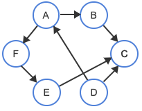
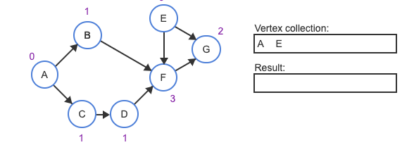

# Week 12: Graph and Final Review

## Overview

## Table of Contents
1. [Topological Sort](#topological-sort)  
    - [Quick Example](#quick-example)  
    - [Identify Valid Topological Sorts](#identify-valid-topological-sorts)  
    - [Topological Sort Algorithm](#topological-sort-algorithm)  
    - [Visual Representation](#visual-representation)  
    - [Questions for Topological Sorting Algorithm](#questions-for-topological-sorting-algorithm)  
2. [Topological Sort Implementation](#topological-sort-implementation)  
    - [Quick Questions about the Implementation](#quick-questions-about-the-implementation)  
3. [Algorithm Efficiency](#algorithm-efficiency)  
    - [Space Complexity](#space-complexity)  
    - [Time Complexity](#time-complexity)  
    - [Questions for Complexity](#questions-for-complexity)

---

## Topological Sort

- Topological ordering is an operation on directed acyclic graphs (DAGs).
- A **topological ordering** is a list of the DAG's vertices such that for every edge from a vertex X to a vertex Y, X comes before Y in the list.
  - Note that it may not be unique!
- A **topological sort** produces a list of topological ordering.
- **Real-Life Applications**: 
  - Scheduling of tasks from the given dependencies among tasks.
  - A student can have an ordered list of courses to take.
- For directed, acyclic graph, there can be more thn one valid topological sort. You will see some examples later on.

---

### Quick Example



#### Proposed Topological Ordering
**C → D → A → F → B → E**

We need to verify that for every edge u → v, vertex u comes before v in the proposed order.

##### Step-by-Step Verification of Edges:

| **Edge (X to Y)** | **X before Y in ordering?** | **Reason**           |
|--------------------|-----------------------------|-----------------------|
| A to B            | Yes                         | A comes before B in the proposed ordering (C, D, A, F, B, E). |
| A to F            | Yes                         | A comes before F in the ordering (C, D, A, F, B, E).          |
| B to C            | **No**                      | B does not come before C; instead, C comes before B.           |
| D to A            | Yes                         | D comes before A in the ordering (C, D, A, F, B, E).          |
| D to C            | **No**                      | D does not come before C; instead, C comes before D.           |
| E to C            | **No**                      | E does not come before C; instead, C comes before E.           |
| F to E            | Yes                         | F comes before E in the ordering (C, D, A, F, B, E).          |

---

**Note:** For the ordering to be valid, vertex X must appear **before** vertex Y in the proposed topological order for each edge (X to Y). If any edge violates this rule, the ordering is invalid.

---

### Hopefully, you now understand how this works. Let's do a couple of more examples!

---

#### Proposed Topological Ordering
**D → A → F → E → C → B**

##### Step-by-Step Verification of Edges:

| **Edge (X to Y)** | **X before Y in ordering?** |
|--------------------|-----------------------------|
| A to B            | Yes                         | 
| A to F            | Yes                         | 
| B to C            | **No**                      |
| D to A            | Yes                         | 
| D to C            | Yes                         | 
| E to C            | Yes                         | 
| F to E            | Yes                         | 

---

#### Proposed Topological Ordering
**D → A → F → E → B → C**

##### Step-by-Step Verification of Edges:

| **Edge (X to Y)** | **X before Y in ordering?** |
|--------------------|-----------------------------|
| A to B            | Yes                         | 
| A to F            | Yes                         | 
| B to C            | Yes                         |
| D to A            | Yes                         | 
| D to C            | Yes                         | 
| E to C            | Yes                         | 
| F to E            | Yes                         | 

---

#### Proposed Topological Ordering
**D → A → F → B → E → C**

##### Step-by-Step Verification of Edges:

| **Edge (X to Y)** | **X before Y in ordering?** |
|--------------------|-----------------------------|
| A to B            | Yes                         | 
| A to F            | Yes                         | 
| B to C            | Yes                         |
| D to A            | Yes                         | 
| D to C            | Yes                         | 
| E to C            | Yes                         | 
| F to E            | Yes                         | 

---

### Identify Valid Topological Sorts

- Indicate whether each vertex ordering is a valid topological sort of the graph below.


**Question 1:**
A, B, C, D, E
- Valid
- Invalid

**Answer:** For every edge from a vertex X to a vertex Y in the graph, X comes before Y in the list.

**Question 2:**
E, D, C, B, A
- Valid
- Invalid

**Answer:** An edge exists from A to C, but A does not come before C in the ordering E, D, C, B, A.

**Question 3:**
D, E, A, B, C
- Valid
- Invalid

**Answer:** An edge exists from C to E, but C does not come before E in the ordering D, E, A, B, C.

**Question 4:**
B, A, C, D, E
- Valid
- Invalid

**Answer:** For every edge from a vertex X to a vertex Y in the graph, X comes before Y in the list.

**Question 5:**
B, A, C, E, D
- Valid
- Invalid

**Answer:** An edge exists from D to E, but D does not come before E in the ordering B, A, C, E, D.

## Topological Sort Algorithm

- Can be done using **source removal**
- A source is a vertex with no incoming edges
- Each step, there is a source that is identified. The source is removed from the graph along with all its outgoing edges. The vertex is then added at the end of the list
- The process continues until all vertices are removed from the graph
- The topological sort algorithm uses three lists:
    - a **results** list that will contain a topological sort of vertices: start as empty
    - a **no-incoming-edges** list of vertices with no incoming edges (source)
    - a **remaining-edges** list: start as all edges
- while the no-incoming-edges vertex list is not empty
    - a vertex is removed from the no-incoming-edges list and added to the result list.
    - a temporary list is built by removing all edges in the remaining-edges list that are outgoing from the removed vertex.
    - For each edge currentE in the temporary list, the number of edges in the remaining-edges list that are incoming to currentE's terminating vertex are counted.
    - If the incoming edge count is 0, then currentE's terminating vertex is added to the no-incoming-edges vertex list.

### Visual Representation


- The topological sort algorithm begins by counting each vertex's incoming edges. Vertices A and E have 0 incoming edges, B, C, and D each have 1, G has 2, and F has 3.



- Vertices with 0 incoming edges, A and E, are then added to a vertex collection. An empty result is also initialized.


- The algorithm's main loop first removes a vertex from the collection. The removed vertex becomes the "current" vertex and is added to the result.


- For each of the current vertex's outgoing edges, the count of edge's to-vertex is decremented. So F's count is decremented from 3 to 2 and G's from 2 to 1.


- Vertex A becomes the current vertex next and is added to the result. Counts for B and C are decremented to 0, upon which each is added to the vertex collection.


- The process continues. The next three iterations visit vertices C, D, and B.


- F is processed similarly, then G. The vertex collection is then empty and so the algorithm is done.

### Questions for Topological Sorting Algorithm

**Question 1:**
Each vertex added to the vertex collection has _____.
- no incoming edges
- a count of 0
- no outgoing edges

**Answer:** During initialization, each vertex with a **count of 0** is added to the collection. During the main loop, each vertex with a count just decremented to 0 is added to the collection. In both cases, a vertex is added only if the vertex's count is **0**.

**Question 2:**
In the example above, the vertex collection behaves like a _____.
- stack
- queue

**Answer:** Removal from the collection takes out the most recently added item. So in the example, the collection is a **stack**.

**Question 3:**
In a code implementation, the vertex collection _____.
- must be a queue
- must be a stack
- could be a queue, stack, or set

**Answer:** The algorithm produces a valid ordering regardless of the vertex collection's ordering. So a **queue, stack, set, or even other types of collections can be used.**

**Question 4:**
What must be true of the last loop iteration's processed vertex?
- The vertex has no incoming edges
- The vertex has no outgoing edges
- The vertex has no incoming edges nor outgoing edges

**Answer:** A vertex X with an outgoing edge to Y must come before Y in the result. But if X is the last vertex processed, then no other vertices will come after X in the result. So the **last vertex** must have **no outgoing edges**.

## Topological Sort Implementation

```pseudo
GraphTopologicalSort(graph) {
   resultList = Create new, empty list of vertices
   noIncoming = Create new, empty vertex stack

   for each vertex V in graph {
      V⇢inCount = Number of edges incoming to V
      if (V⇢inCount == 0) {
         Push V to noIncoming stack
      }
   }
   
   while (noIncoming is not empty) {
      currentVertex = Pop from noIncoming
      Append currentVertex to resultList

      outgoingEdgeList = Get currentVertex's outgoing edges
      for each edge E in outgoingEdgeList {
         Decrement E⇢toVertex's count
         if (E⇢toVertex's count is 0) {
            Push E⇢toVertex to noIncoming
         }
      }
   }
         
   return resultList
}
```
### Quick Question about the Implementation

**Question 1:**
What does GraphTopologicalSort() return?
- a list of vertices
- a list of edges
- a list of indices

**Answer:** The algorithm produces an ordering of vertices and therefore returns a **list of vertices**.

**Question 2:**
The topological sort algorithm does not work on a graph with one or more vertices but no edges.
- True
- False

**Answer:** If no edges exist, the algorithm first adds all vertices to noIncoming. Then each loop iteration adds one of those vertices to resultList, producing an ordering with all graph vertices. For a graph with no edges, any ordering of vertices is a valid topological sort. So since the algorithm adds all vertices to the result, the **algorithm does work for a graph with no edges**.

## Algorithm Efficiency

- **Vertex and Edge Lists:**  
  The algorithm uses two lists for vertices and one for edges. At most, these lists will include all the vertices and edges in the graph.

- **Space Complexity:**  
  If the graph has **V** vertices and **E** edges, the space needed for the algorithm is **O(V + E)** because it has to store all the vertices and edges.

- **Time Complexity:**  
  If the graph lets you get a vertex’s incoming and outgoing edges quickly (in constant time), the algorithm also runs in **O(V + E)** time. This is because every vertex and edge is processed exactly once.

### Question for Complexity
For these calculations, we assume:
  - There’s at least 1 vertex and 0 or more edges.
  - The graph is **connected** (you can reach every vertex from at least one other vertex).
  - Operations like adding to a stack or list are very fast (constant time). 

**Question 1:**
All initialization code before the while loop executes in worst case _____ time.
- `O(1)`
- `O(V)`
- `O(E)`

**Answer:** The for loop iterates V times. Operations before the loop and within the loop body execute in `O(1)` time. So the total initialization executes in `O(1) + V * O(1) = O(V)` time

**Question 2:**
The while loop executes a minimum of _____ iterations.
- 0
- V
- E

**Answer:** Every graph vertex is added to noIncoming eventually, so the loop always iterates **V** times. noIncoming has at least 1 vertex after initialization. Loop iterations then eventually decrement every other vertex's count to 0 and then add the vertex to noIncoming.


**Question 3:**
The algorithm's worst case runtime complexity is _____.
- `O(V)`
- `O(V + E)`
- `O(V * E)`

**Answer:** The main while loop iterates V times. Excluding the nested for loop, each iteration performs `O(1)` operations. So the main loop minus the nested loop takes `O(V)` time. All iterations of the nested loop combined visit all E edges in the graph. So the initialization, plus the main loop minus the nested loop, plus all iterations of the nested loop is: `O(V) + O(V) + O(E) = O(V + E)`
.

**Question 4:**
Assuming each vertex's list of outgoing edges is already prebuilt, the algorithm's auxiliary space complexity is _____.
- `O(V)`
- `O(E)`
- `O(V + E)`

**Answer:** The algorithm creates two new collections: resultList and noIncoming. Each never has more than V items. A count is associated with each vertex and so V integer counts exist. The list of outgoing edges in the while loop is already prebuilt, and so adds nothing to the auxiliary space complexity. Therefore the space complexity is `O(V)`

